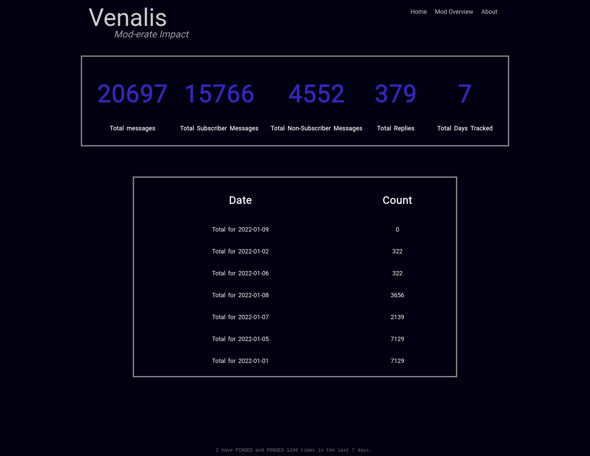
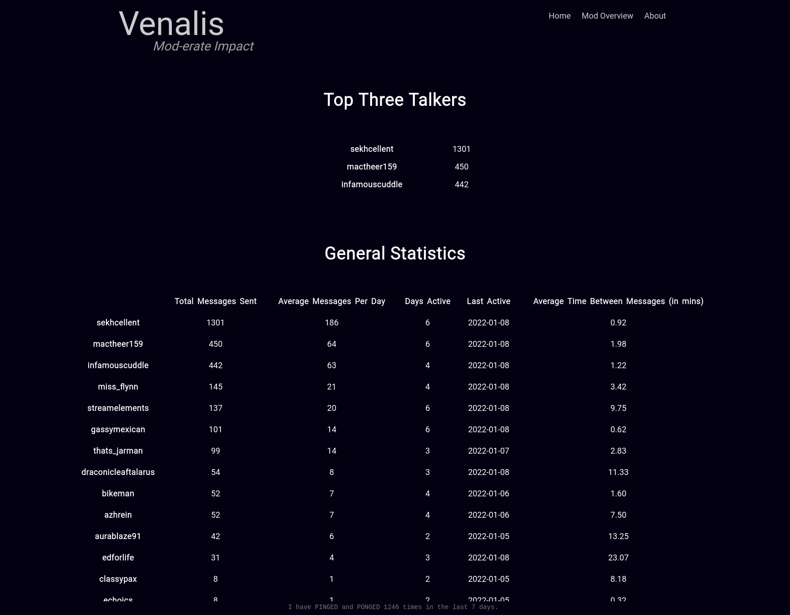

# Mod-erate Impact

A Twitch Moderator Tracker

This was designed to help Twitch Streamers keep track of how interactive their Moderators are in their respective community. I stole the idea from [Venalis](https://twitch.tv/venalis) when he had stated he was wanting something that did this exact thing. I hope that it will be useful to any streamer looking to keep track of the information provided.

## Home Page 
The top left where it states "Venalis" is actually the channel name. This will change depending on what Twitch Chat your following.

## Mod Overview Page
There is no need to manually update any Moderator usernames, this program will keep track of who is a Moderator in your channel for you!

----
## Setup

### Settings
 
In order to run the application you will need to modify the `setting.yaml` file. I would _highly_ reccomend using notepad++ or VSCode because YAML can be finicky with tabs. If it doesn't work, remove any comments/added lines, and ensure there are only the required information with no additional spaces. 

#### Nickname

The `nickname` will be YOUR twitch username in lowercase.

#### Channel

The `channel` option will be the channel name in lowercase your interested in using to track the moderator information. 

#### OAuth_Secret

The option `oauth_secret` can be found via [Twitch Chat OAuth Password Generator](https://twitchapps.com/tmi/). This website, while not affiliated with Twitch, is referenced directly in [Twitch's IRC Guide](https://dev.twitch.tv/docs/irc/guide) as a quick and easy way to grab an oauth token. This will be used with your nickname to sign into the IRC in order to track the chat information. 

## Running Mod-erate Impact

### Docker

To setup using docker, git clone this repo then run the following commands:

1. Install [Docker](https://docs.docker.com/engine/install/)
1. Build your docker image: `docker build . -t moderate_impact:1.0`
2. Update the `docker-compose.yml` file to your liking.
3. Update the `settings.yaml` file.
4. Run the image: `docker-compose up -d`
5. If running locally, browse to: `http://localhost:8080`, otherwise browse to `http://<IP ADDRESS>:8080`

Enjoy! The application will begin tracking moderator information

### Local Install (Probably the easiest!)

I would highly advise running this on a [RaspberryPi](https://www.raspberrypi.com/products/raspberry-pi-4-model-b/) as this application is made to track Chat 24/7 - 365. As such, having a dedicated server, or application that runs always would be very useful to you. Otherwise if you just never shut down your local computer then maybe this would work well for you!

1. [Install Python](https://www.python.org/downloads/)
2. From the command line, run: `python3 -m pip install -r requirements.txt`
3. Finally run: `python3 main.py`
4. Browse to: `http://localhost:8080`

### Using the provided Executable 

1. To setup using the provided executable, download and extract the `Moderate-Impact.zip` file into your prefered location. 
2. Execute the binary **SEE NOTE BELOW**
3. There will be no application window that opens up, it will just background its-self. Since it's essentially a web-server you can now open up your perferred web browser and go to `http://localhost:8080` and access the web page!
3. If you would like it to start when you start your computer follow [these instructions.](https://www.howtogeek.com/208224/how-to-add-programs-files-and-folders-to-system-startup-in-windows-8.1/)

> *NOTE:*, You may recieve a warning from Smart Screen that this is from an unverified publisher! This is normal, as I'm too cheap to pay $300 to sign my code. If you don't trust the binary, feel free to read through my code or compile it yourself! Also you will end up with a Firewall question, related to if you want to allow the executable to access the local network. This is so that the socket can listen and connect to the Twitch IRC and is expected behavior. 

## Other

### Building Windows Executable from scratch

1. [Install Python](https://www.python.org/downloads/)
2. From the commannd line, run: `python3 -m venv venv`
3. Source your new virtual environment: `source venv/bin/activate`
4. Install requirements: `python3 -m pip install -r requirements.txt`
5. Install pyinstaller: `python3 -m pip install pyinstaller`
6. Run the following command: `pyinstaller --onefile -w --add-data "templates;templates" --add-data "static;static" .\main.py --hidden-import=PyYaml --hidden-import=pandas --hidden-import=waitress --hidden-import=flask --name mod-erate-impact`
7. Copy `settings.yaml` and `chat_logs` to the newly created `dist` folder
8. Enjoy your from source compiled executable!

### Future Additions
  * I would like to get a logo for this at some point... 
  * I have most of the information built out to start tracking totals per day, and average time between messages per day for each Moderator. I'd like to build out a page per Moderator that you can view the history for each Mod.